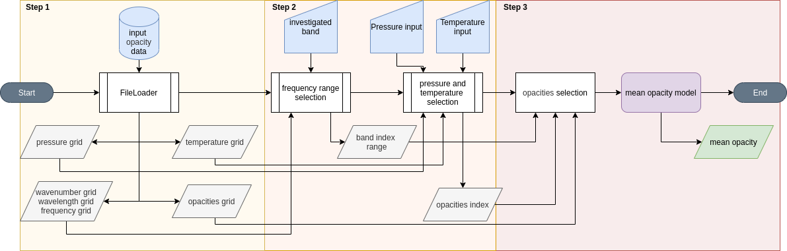

==============================
API Guide
==============================
The `RAPOC` code implements a base :class:`~rapoc.models.model.Model` class that loads the input data
(consisting of opacities expressed as a function of a grid of pressures, temperatures and a wavelength range,
and produces the RPO estimates.
From the :class:`~rapoc.models.model.Model` class, two other classes are derived that implement the
:class:`~rapoc.models.model.Rosseland` and :class:`~rapoc.models.model.Planck` mean opacity algorithms.
The scheme of the code workflow is as follows:

+ Yellow box: this is the first step of the code, which consists of reading the input data.
  In this step `RAPOC` loads the data from the input file.
  From the input file, `RAPOC` extracts the opacities with their respective pressures, temperatures and wavenumbers.
+ Orange box: This is the second step, which involves the analysis of the user's input.
  Here, the user can specify the wavelength (or wavenumber, or frequency) interval, pressure,
  and temperature for calculating the RPO values. The code automatically parses the input data and uses it for the final step.
+ Red box: in the third and final step, `RAPOC` extracts the specific wavelength-dependent opacities
  (for the pressure and temperature requested as well as the wavelength, wavenumber or frequency range chosen)
  and uses them to compute their corresponding RPO values.
  These values are taken from the complete opacity table that encompasses the total parameter space.
  The conversion from wavelength-dependent opacities to RPOs is accomplished by using the mean opacity models.
  This can be either the Rosseland or Planck model. Finally, the code returns the estimate.

API Content
==============================
.. toctree::
    :maxdepth: 2

    Planck model <planck_api>
    Rosseland model <rosseland_api>
    Rayleigh model <rayleigh_api>
    Base model <model_api>
    ExoMol file loader <exomol_api>
    DACE file loader <DACE_api>
    Dict loader <dict_loader_api>
    Base file loader <file_loader_api>
