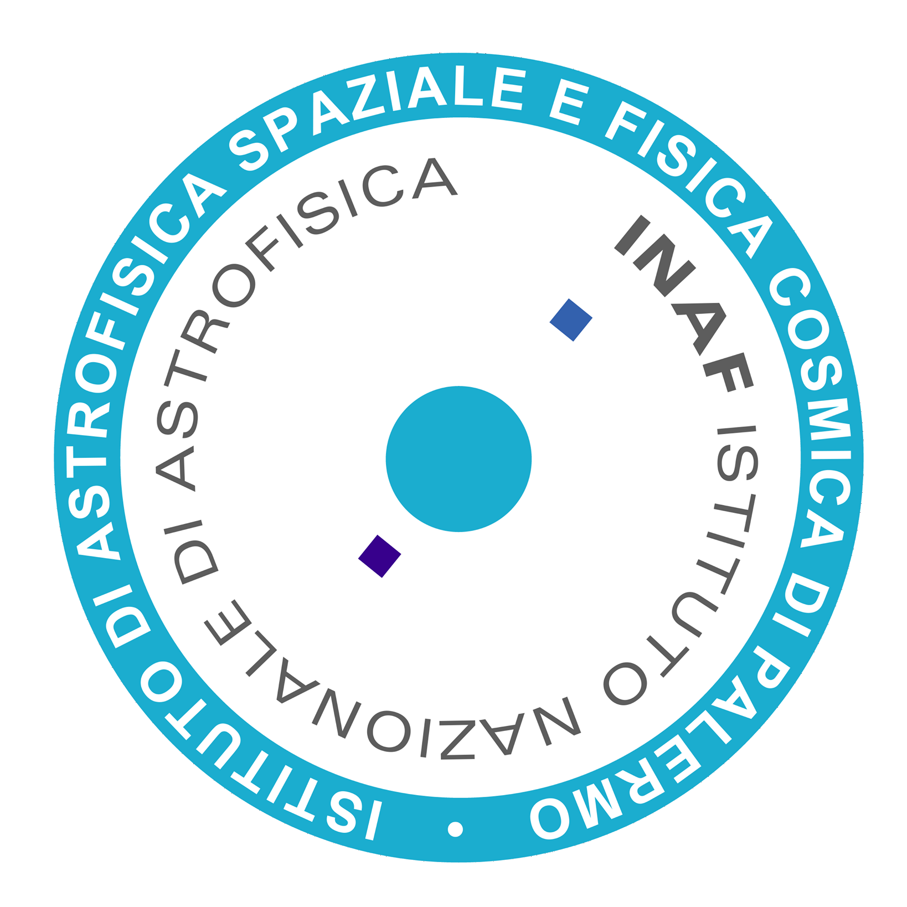

===================================================
RAPOC: Rosseland And Planck Opacity Converter
===================================================

.. image:: _static/logo.png
   :width: 600
   :align: center

Developed by Lorenzo V. Mugnai and Darius Modirrousta-Galian, the RAPOC code is the product of a collaboration between Sapienza Università di Roma,
Università degli Studi di Palermo and INAF - Osservatorio Astronomico di Palermo.

`RAPOC` uses molecular absorption measurements (i.e. wavelength-dependent opacities) to calculate Rosseland and Planck
mean opacities that are commonly used in atmospheric modelling.

`RAPOC` is designed to be simple, straightforward, and easily incorporated into other codes.
It is completely written in Python and documented with docstrings.

.. toctree::
   :maxdepth: 2
   :caption: Contents:

   Installation <installation>
   User Guide <user_guide>
   Full API <api/index>

Cite
-----
If you use this code or its results, please cite `RAPOC: the Rosseland and Planck opacity converter` by Mugnai L. V. and Modirrousta-Galian D. (submitted).

Meet the authors
-----------------------
For more information on the authors, please see their personal websites:

    + `Lorenzo V. Mugnai <https://www.roma1.infn.it/~mugnailo/>`_
    + `Darius Modirrousta-Galian <https://www.dmodirrousta-galian.com/>`_